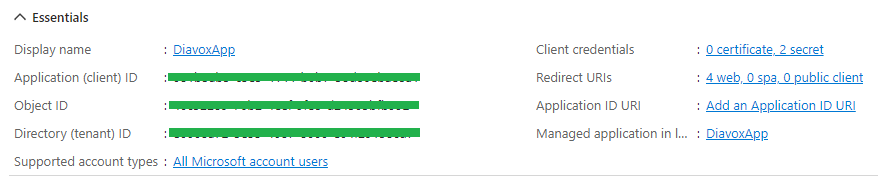
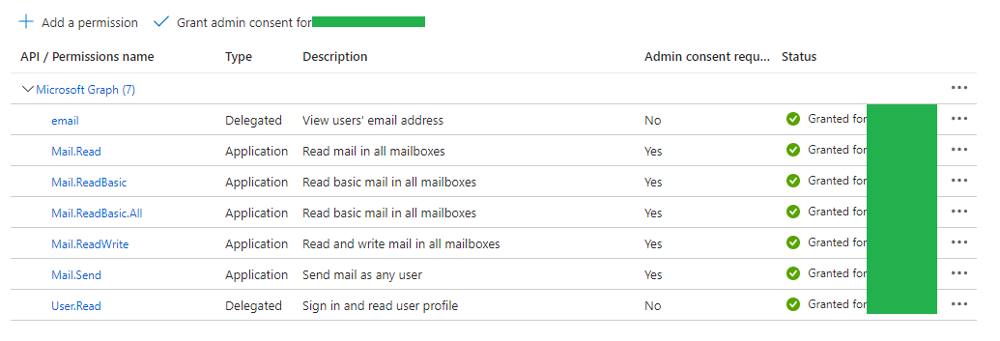
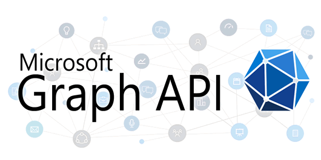

# PHP-PracticalExample-MicrosoftGraphAPI

- This is a practical example to test Microsoft Graph API Integration.
- This example assumes you already know how to clone, test and deploy your PHP web applications.
- It is required for you to read Microsoft Graph API documentation [here](https://learn.microsoft.com/en-us/graph/use-the-api).
- You can use the Microsoft Graph API with a free personal Microsoft user account. Microsoft Graph API provides programmatic access to a wide range of Microsoft services and data, including Outlook, OneDrive, Calendar, Contacts, and more.
- However, keep in mind that there might be limitations based on the services you're trying to access and the specific features you're using. Some premium or advanced features might require a subscription or license upgrade.

## Installation

- Clone the application
- Run `cp 'env_copy.ini' env.ini` to create a configuration file.
- Run `composer install` to install vendor packages.
- Configure your client_id, client_secret, tenant_id, and an object_id.

## Quickstart Guide to Microsoft Graph API

- You can create your application in Portal Azure of Microsoft 365. Go to this link [here](https://portal.azure.com)

### To Create or Register An Application
- Go to **Manage Azure Active Directory** -> **Certificates and Secrets**.
- Click on **New Client Secret**. Name your client and make sure you copy and keep the client secret value in a text file or paste that info in your env.ini on **CLIENT_SECRET=** before leaving the page.

### To Get Your Client ID and Tenant ID
- If you are an administrator, go to **Overview**

### To Give API Permissions
- Go to **API Permissions**.

## Resources

- **Vanilla PHP** just means plain original PHP without any framework.
- **Guzzle HTTP** is a popular PHP library that simplifies sending HTTP requests and working with HTTP responses.

## Tools

- [Microsoft Graph Explorer](https://developer.microsoft.com/en-us/graph/graph-explorer) - is a web-based tool provided by Microsoft that allows developers and users to interactively explore and experiment with the capabilities of the Microsoft Graph API.

## Screenshots

## Developer

- [Jerome Soriano](https://github.com/dvxgit-jsoriano)

*"Feel free to read, use, and apply to your projects."*